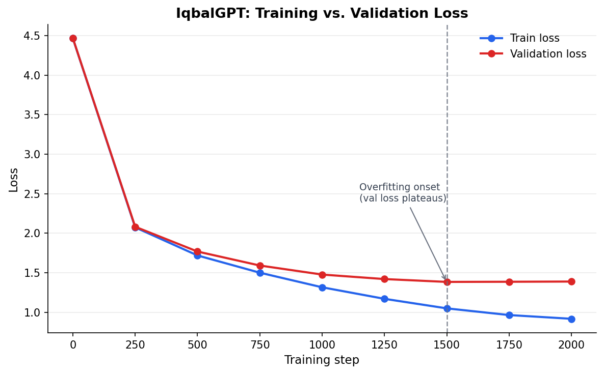

# IqbalGPT

A character-level GPT language model trained from scratch on the poetry of Allama Iqbal, built using Andrej Karpathy's nanoGPT framework.

## What it does 

Generates Iqbal-style poetic text via autoregressive sampling. The model was trained entirely from scratch on a single work: **"The Secrets of the Self" (Asrár-i Khudí)**, R.A. Nicholson's 1920 English translation of Iqbal's original Persian philosophical poem — a public domain text sourced from Project Gutenberg.

## Model details

- Transformer architecture (nanoGPT), trained from scratch — **3.17M parameters**
- 4 layers, 4 attention heads, 256-dim embeddings, **128 block size**, 0.2 dropout — sized down deliberately to suit the smaller single-source corpus
- Character-level tokenization, vocabulary of 86 unique characters
- Trained on Google Colab (T4 GPU), 2000 iterations

## Data

- Source: [*The Secrets of the Self*](https://www.gutenberg.org/ebooks/57317), translated by Reynold A. Nicholson (Macmillan, 1920), via Project Gutenberg — public domain
- Original work: *Asrár-i Khudí* by Muhammad Iqbal (Lahore, 1915)
- ~163KB train / ~18KB validation (90/10 split)

## Setup

```bash
git clone https://github.com/karpathy/nanoGPT.git
cd nanoGPT
pip install torch numpy transformers datasets tiktoken wandb tqdm

# place your cleaned text as data/iqbal/input.txt, then:
cp data/shakespeare_char/prepare.py data/iqbal/prepare.py
python data/iqbal/prepare.py

# train
python train.py config/train_iqbal.py

# generate
python sample.py --out_dir=out-iqbal --start="Khudi" --num_samples=3 --max_new_tokens=300
```

## Evaluation

- Final train loss: **0.92** (step 2000)
- Final validation loss: **1.39**
- Perplexity: **~4.0** (e^1.39)
- **Overfitting onset identified around step ~1500** — validation loss plateaued (1.38 → 1.39) while training loss kept dropping (1.05 → 0.92) through step 2000, indicating the model began memorizing rather than generalizing past that point. The step-1500 checkpoint is arguably the better model, even though training continued to 2000.
- Qualitative check: the model reliably reproduces domain-specific vocabulary ("Self," "Love," "philosophy," "Moslem," "Brahmin"), poetic line structure, and even picked up the verse-numbering convention from the source text formatting. Grammar breaks down at the phrase level ("waterdren me sight") — an expected limitation of character-level modeling on a small (~160KB) corpus, where the model learns local character patterns faster than full grammatical structure.



## Sample output

```
The hour eyes with made the reveal of the power!
My stupe in the Self is the riders of the birds

                      895

The candle he and were excent like a little.
It become woves the joy of lions in the uposs that fire!
He wilt thou art this waterdren me sight,
'Twith the Moslem's eye of hunt
---------------
The houre consumed in the seed, "O thou whose secret us and country,
Thou whose head the camel of his broken of self:
One to cannot melter of melody of the Self,
Thou hast thou mayst will decloud of the sea of the Brahming.
His song candle the cause of young,
It is govening by the strong of Love
```


## A note on this project

This model is a small technical exercise in character-level language modeling — it is not, and could never be, a replacement for Allama Iqbal's actual words. Iqbal's poetry carries philosophical depth, spiritual weight, and linguistic mastery that no few-million-parameter model trained on a laptop or free-tier GPU could approach. This project exists to explore how transformers learn structure and style from text, using his work as a respectful case study — not to imitate or diminish it.

## Acknowledgments

- [nanoGPT](https://github.com/karpathy/nanoGPT) by Andrej Karpathy
- Text sourced via [Project Gutenberg](https://www.gutenberg.org)
